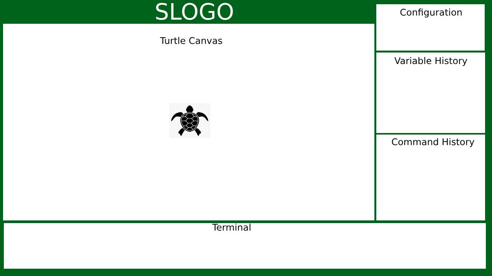

# SLogo Design Document

## Introduction
### Problem Solved By Program

Our group is attempting to create an environment in which simple Logo programs can be written and executed.

### Primary Design Goals of the Project
The primary design goal of this project is to create a flexible network of four APIs that implements a basic interpreter of the Slogo language that has hierarchies in place to facilitate flexible addition of features.

### High Level Perspective of Program
The program's front end will be composed of at least 4 views: a canvas that contains the turtle that allows the canvas to be drawn on, a terminal that takes in input commands, a history view that contains past commands passed to the backend, and a workspace containing the current values of variables in use.

## Design Overview
### External Backend API
The external backend API will provide functionality to run the command(s) entered into the terminal. This will occur through the runCommands() method which will take in the string representing all of the commands. The method will return a queue of the results of the commands. The results will be Turtle objects representing the different states of the turtle during and after the execution of the commands. These objects will have methods to access the various fields of the turtle from the frontend.

### External Frontend API
The external frontend API will consist of a list of strings that make up the terminal history. This will have a method called getCommand() that will take in an index of the desired command to return the command entered matching the index.

### Internal Backend API
The internal backend API will provide functionality to parse commands and evaluate the expressions representing the commands. These will occur through the parseCommands() method in Parser and the evaluate() method in Expression.

### Internal Frontend API

Within the frontend, there are various pairs and sets of components that will need to interact with each other in order for the frontend to function cohesively.

The most important part of the internal API of the frontend will require the canvas to be updated after a program is run (and a list of TurtleStates is acquired from the backend). This will take into account the current state of the configuration and draw lines accordingly.

### Picture of Components Relation

## User Interface
### Overall Apearance
The overall appearance of the user interface will consist of four main boxes to begin with. These boxes will be
1. Canvas: where the turtle is moved and the drawings are created.
2. Terminal: where users input commands
3. Variable History: where the current value of variables is displayed
4. Command History: where valid commands that the user has previously entered is displayed

### User Interaction Description
The user will be able to interact with the program through the terminal. The commands they type will be passed to the backend, and if valid they will be added to the command history and the actions corresponding to these commands will be performed.

### Picture of User Interface
In doc folder as "GraphicsExample.jpg"

## API Details
### External Backend API
* Specific Feature Support: Accepting lists of commands to parse, specifying details about the elements to be drawn in the front-end, track defined variables and features
* Resources Used: Internal parsing libraries
* Use Intention: Set up as an abstraction layer to hide back-end logic about command parsing from the front-end
* Flexibility for Extension: Can be extended to reveal more information about each state.

### External Frontend API
* Specific Feature Support: track command history, feed list of history to command history
* Resources Used: Lists
* Use Intention: Call old commands again
* Flexibility for Extension: Able to use and track that commands have been used before

### Internal Backend API

* Specific Feature Support: Parsing commands and tracking state
* Resources Used: None
* Use Intention: Processes and implements the logic from each command
* Flexibility for Extension: Can be extended to add new commands for parsing as well as new states for the turtle.

### Internal Frontend API
* Specific Feature Support: Updating canvas after a program is executed
* Resources Used: List of TurtleStates returned by the backend after execution
* Use Intention: to update the programmer on the state of their turtle after the execution of a program, and to show the designs the turtle leaves
* Flexibility for Extension: Place to add different turtle images and possible other changes in the visualization of the SLogo program

* Specific Feature Support: Changing features of the environment (background color, turtle image, pen color, language)
* Resources Used: Lists of selectable options for each of these features
* Use Intention: to be used as a set of menus that the user can change
* Flexibility for Extention: Can be extended to change any cosmetic features of our IDE or the canvas.

## API Example Code
### Use Examples
1. The user types 'fd 50' in the command window, and sees the turtle move in the display window leaving a trail, and the command is added to the environment's history.
    * Once entered, the parser will call getInput() on the terminal, parse the string into the command and the constant, and adjust the Turtle location by using setTurtlePosition(getTurtleYPosition()+50). The frontend will then call getTurtleState() which will return the state of the turtle, giving the x position, y position, and pen up or pen down. It will then move the turtle to the correct position and set all values between it's current position and end position black.
2. Ian: The user enters the command '50 fd'.
    * The message is passed to the parser. The parser will throw a WrongCommmand exception as 50 will not be contained in the command enumeration, and the try catch statement that this was attempted in will catch the exception and open a new ErrorDisplay box.
3. Ian: The user changes the language, by selecting 'Spanish' in the dropdown.
    * The parser will call will call getInput(translate(language, line)) and pass the translated English line to the parser.
4. Jonathan: The user enters a command to put the turtle's pen up.
    * The parser will parse the command and create an Expression object to represent it. The Controller will then call this expression's evaluate() method, which will return a Turtle object with the penState set to up (false). Any future commands to move the turtle without putting the pen down will return Turtle objects with the penState still set to up. Thus, the frontend will display future turtle moves without the turtle leaving a trail behind.
5. Jonathan: The user enters a command to get the value of a variable.
    * The parser will parse the command and create an Expression object to reprent it. This expression's evaluate() method will be called by the Controller and will return the value of the variable. This value will then be returned to the frontend, which will display it.
6. Rishi: The user changes the color of the turtle by clicking in a dropdown and selecting 'red'.
    * Once clicked, the value for 'turtlecolor' in  configObject will be changed to 'red' configMap.set('TurtleColor', 'Color.RED') such that when the Canvas updates itself. Each time the turtle is rendered or updated at a position specified by a TurtleState, its fill color will be updated!
7. Rishi: From the terminal, a user selects and runs the most previously run command
    * When the up arrow is pressed in the terminal, the terminal will history.fetch(-1) the most recent command from the History object, which will then be applied into the active text field in the terminal. When the run button is pressed, the command will be passed into the parser as normal.
8. Sachal: A user enters the command CLEARSCREEN
    * Upon entering the command into the terminal, it is passed along to the parser which will evaluate it and return a new Turtle with default states and at the 0,0 position. Specifically, this turtle will have flags to communicate to the display that all previous lines should be erased. More so, it will propogate the distance moved to any enclosing commands.
10. Sachal: A user defines a new variable
    * The user's input is passed from the terminal to the parser which then allocates space to map the name of the variable to the expression it equates to. This information is then returned in the form of a complete mapping of all variables to their values/types to be displayed on the variable view.

## Design Considerations
### Issues Addressed
* Should the program continue if an invalid command is entered?
    * We decided that the program should not continue if an invalid command is entered. This is supposed to be a coding tool to teach the basics of programming, so like most major coding programs we believe it is important to understand errors.

### Ambiguities, Assumptions, or Dependencies
* Assume that nothing needs to be printed for math operations, only that the program be able to perform them

## Team Responsibilities
* Ian: Front-end
* Jonathan: Back-end
* Rishi: Front-end
* Sachal: Back-end
